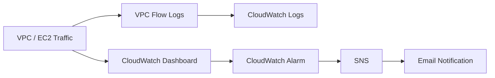

# 🚗Linux, Bash & AWS Cloud Monitoring Projects

A practical collection of **Linux administration, Bash scripting, AWS CLI, IAM, EC2, VPC, CloudWatch, SNS, and network monitoring projects** developed through hands-on system administration and cloud automation exercises.

This repository demonstrates practical skills in **Linux command-line operations, shell scripting, text processing, web server automation, AWS resource provisioning, IAM security, cloud monitoring, logging, alerting, and infrastructure automation**.

---

## 🚀 Project Overview

The repository contains multiple assignments and practical implementations covering:

* 🐧 Linux System Administration
* 💻 Bash Shell Scripting
* 📁 Linux File & Permission Management
* 🔍 Process Management
* 🌐 Networking & Network Interfaces
* 🔧 Nginx Web Server Automation
* 📊 Linux Resource Monitoring
* ☁️ AWS CLI Automation
* 🔐 AWS IAM User & Role Management
* 🖥️ Amazon EC2
* 🌐 Amazon VPC
* 📝 VPC Flow Logs
* 📈 Amazon CloudWatch
* 🔔 Amazon SNS Notifications
* 📊 CloudWatch Dashboards & Alarms
* 🛠️ `grep`, `awk`, `sed`, `cut`, `sort`, `wc`
* 🔄 Pipelines and Redirection
* 📜 Log Processing
* ⚙️ Infrastructure Automation

---

# 🏗️ Cloud Monitoring Architecture

The main AWS monitoring project implements an end-to-end observability workflow:

```text
                    ┌──────────────────────┐
                    │      Amazon VPC      │
                    │                      │
                    │   ┌──────────────┐   │
                    │   │     EC2      │   │
                    │   │   Instance   │   │
                    │   └──────┬───────┘   │
                    │          │           │
                    │     Network Traffic  │
                    └──────────┼───────────┘
                               │
                               ▼
                    ┌──────────────────────┐
                    │    VPC Flow Logs    │
                    └──────────┬───────────┘
                               │
                               ▼
                    ┌──────────────────────┐
                    │  CloudWatch Logs     │
                    │ /aws/vpc/flowlogs    │
                    └──────────────────────┘


       EC2 Metrics
   ┌─────────────────────────────┐
   │ NetworkIn                   │
   │ NetworkOut                  │
   │ CPUUtilization              │
   └──────────────┬──────────────┘
                  │
                  ▼
       ┌────────────────────────┐
       │   CloudWatch Dashboard │
       └────────────┬───────────┘
                    │
                    ▼
       ┌────────────────────────┐
       │    CloudWatch Alarm    │
       │                        │
       │ Threshold exceeded?    │
       └────────────┬───────────┘
                    │
                    ▼
              ┌───────────┐
              │    SNS    │
              └─────┬─────┘
                    │
                    ▼
             📧 Email Alert
```

The project captures VPC traffic through **VPC Flow Logs**, sends the records to **CloudWatch Logs**, monitors EC2 metrics through a **CloudWatch Dashboard**, and uses a **CloudWatch Alarm + SNS** for threshold-based notifications.

---

# 📂 Repository Structure

```text
linux-bash-aws-projects/
│
├── README.md
│
├── Assignment-1/
│   ├── file-management.sh
│   ├── process-management.sh
│   └── networking.sh
│
├── Assignment-2/
│   ├── nginx_manager.sh
│   ├── arithmetic_ops.sh
│   └── static-website.sh
│
├── Assignment-3/
│   ├── network-info.sh
│   ├── file-loop.sh
│   ├── create-data-file.sh
│   ├── create-files-until.sh
│   └── text-processing.sh
│
├── Assignment-4/
│   ├── latest-file.sh
│   ├── login-analysis.sh
│   └── find-conf.sh
│
├── Assignment-5/
│   ├── csv-processing.sh
│   └── log-processing.sh
│
├── Assignment-6/
│   └── provision_iam.sh
│
├── Assignment-7/
│   ├── create-iam-user.sh
│   ├── create-iam-role.sh
│   └── ec2-check.sh
│
└── AWS-CloudWatch-Monitoring/
    ├── README.md
    ├── scripts/
    ├── policies/
    ├── dashboard.json
    ├── diagrams/
    └── screenshots/
```

---

# 🐧 Assignment 1 — Linux Administration

Demonstrates fundamental Linux system administration tasks:

* Managing sudo privileges
* Creating, renaming and moving files
* Directory creation
* File permissions with `chmod`
* Output redirection
* Configuration file management
* Process identification using `ps`
* Terminating processes using `kill`
* File backup using `cp`
* Network connectivity testing with `curl`

Example permission requirement:

```text
-rw-r-----
```

---

# ⚙️ Assignment 2 — Bash & Nginx Automation

Automates the installation and configuration of an Nginx web server.

### Workflow

```text
Check Nginx
     │
     ▼
Installed?
 ┌───┴────┐
 │        │
No       Yes
 │        │
 ▼        │
Install   │
 │        │
 └───┬────┘
     ▼
Start Nginx
     │
     ▼
Backup index.html
     │
     ▼
Deploy Custom Website
     │
     ▼
Reload Nginx
     │
     ▼
Check CPU / RAM / Disk
     │
     ▼
Verify Nginx Status
```

The Nginx automation also demonstrates:

```bash
systemctl
ls -l
cp
tee
top
free
df
curl
```

---

# 🔤 Assignment 3 — String Manipulation & Loops

Hands-on exercises using Linux text-processing utilities and Bash control structures.

### Tools

```text
grep
awk
sed
cut
cat
wc
test
for
until
if / elif / else
```

Examples include:

* Extracting IPv4 addresses
* Extracting subnet masks
* Finding broadcast addresses
* Processing `.txt` files
* Categorizing files by line count
* Creating files using loops
* Regex-based searching
* Text replacement using `sed`

---

# 🔎 Assignment 4 — Linux File & User Analysis

Demonstrates more advanced Linux commands.

### Topics

* Finding the latest modified file
* Creating file backups
* Finding the most frequently occurring word
* Identifying the last logged-in user
* Finding files owned by a user
* Searching the filesystem using `find`
* Transforming file paths using `sed`

Example pipeline:

```text
File
 │
 ▼
tr
 │
 ▼
sort
 │
 ▼
uniq -c
 │
 ▼
sort -nr
 │
 ▼
Most Frequent Word
```

---

# 📊 Assignment 5 — CSV & Log Processing

Demonstrates practical Linux data-processing pipelines.

### CSV Processing

```text
CSV Files
   │
   ├── cut
   ├── awk
   ├── sed
   ├── sort
   └── wc
```

Operations include:

* Counting CSV files
* Counting records
* Extracting columns
* Filtering employees
* Regex-based searches
* Replacing status values
* Finding unique regions
* Building multi-command pipelines

### Log Processing

A sample log is generated and analyzed using:

```bash
head
tail
grep
wc
```

Example:

```text
events.log
    │
    ├── First 5 lines
    ├── Last 5 lines
    ├── Lines excluding last 3
    ├── Line 15 → End
    ├── Specific line
    └── Last FAIL events
```

---

# 🔐 Assignment 6 — AWS IAM Provisioning

A Bash-based AWS IAM provisioning workflow that:

1. Reads employee information from CSV
2. Validates usernames
3. Validates departments
4. Validates access levels
5. Creates IAM users
6. Assigns policies
7. Creates custom policies when required
8. Handles failures
9. Generates logs
10. Produces a final provisioning report

### IAM Provisioning Flow

```text
users.csv
    │
    ▼
Validate CSV
    │
    ├── Invalid ──► REJECTED
    │
    ▼
Validate Access
    │
    ├── Invalid ──► REJECTED
    │
    ▼
Check IAM User
    │
    ├── Exists ──► SKIPPED
    │
    ▼
Create IAM User
    │
    ▼
Attach Policy
    │
    ▼
SUCCESS / FAILED
    │
    ▼
Final Report
```

---

# ☁️ Assignment 7 to 11 — AWS IAM & EC2

AWS CLI exercises covering:

* IAM user creation
* Administrator policy attachment
* IAM role creation
* Custom IAM policy creation
* S3 read-only permissions
* EC2 information retrieval
* Elastic IP verification

Example architecture:

```text
              AWS Account
                   │
          ┌────────┴────────┐
          │                 │
       IAM Users         IAM Roles
          │                 │
          ▼                 ▼
       Policies         Permissions
                            │
                            ▼
                         AWS S3
```

---

# 📈 AWS Cloud Monitoring Project

The major project focuses on **AWS Cloud Monitoring & Network Observability**.

### Components

| Component            | Purpose                      |
| -------------------- | ---------------------------- |
| Amazon VPC           | Network environment          |
| VPC Flow Logs        | Capture network traffic      |
| CloudWatch Logs      | Store flow-log records       |
| EC2                  | Monitored compute resource   |
| CloudWatch Metrics   | Monitor EC2 activity         |
| CloudWatch Dashboard | Visualize metrics            |
| CloudWatch Alarm     | Detect threshold violations  |
| Amazon SNS           | Send notifications           |
| IAM                  | Provide required permissions |
| Bash + AWS CLI       | Automate configuration       |

The project specifically uses EC2 `NetworkIn`, `NetworkOut`, and `CPUUtilization` for monitoring.

---

# 📊 Monitoring Dashboard

The CloudWatch dashboard is designed around:

```text
┌─────────────────────────────────────────┐
│          EC2 MONITORING                 │
├─────────────────────────────────────────┤
│                                         │
│   NetworkIn          NetworkOut         │
│   ─────────          ──────────         │
│      📈                 📈              │
│                                         │
│            CPUUtilization               │
│            ──────────────               │
│                  📈                     │
│                                         │
└─────────────────────────────────────────┘
```

The submitted project identifies `NetworkIn` and `NetworkOut` as dashboard metrics, with `CPUUtilization` included in the automated monitoring workflow.

---

# 🚨 CloudWatch Alarm Workflow

```text
EC2 NetworkIn
      │
      ▼
CloudWatch Metric
      │
      ▼
Check Threshold
      │
      ▼
┌───────────────┐
│ Threshold     │
│ exceeded?     │
└───────┬───────┘
        │
       YES
        │
        ▼
CloudWatch Alarm
        │
        ▼
       SNS
        │
        ▼
   Email Alert
```

The documented alarm uses `NetworkIn`, a 5-minute period, one evaluation period, and a threshold of `1,000,000`, with an SNS topic as the alarm action.

---

# 🛠️ Technologies Used

```text
Linux
Bash
Shell Scripting
AWS CLI
Amazon EC2
Amazon VPC
VPC Flow Logs
AWS IAM
Amazon CloudWatch
CloudWatch Logs
CloudWatch Dashboard
CloudWatch Alarm
Amazon SNS
Nginx
Git
GitHub
```

---

# 🧠 Skills Demonstrated

### Linux

* File system management
* Permissions
* Process management
* Networking
* System monitoring
* User management
* Log analysis

### Bash

* Variables
* Conditions
* Loops
* Functions
* Command substitution
* Pipes
* Redirection
* Exit codes
* Error handling
* Automation

### Text Processing

```text
grep → Search
awk  → Extract / Process
sed  → Transform
cut  → Select fields
sort → Sort data
uniq → Count duplicates
wc   → Count
```

### AWS / Cloud

* IAM security
* EC2 management
* VPC networking
* Flow-log collection
* CloudWatch monitoring
* Dashboard creation
* Alarm configuration
* SNS notification
* AWS CLI automation

---

# 📁 Recommended Diagram Folder

```text
diagrams/
│
├── aws-architecture.png
├── cloudwatch-monitoring.png
├── vpc-flowlogs.png
├── iam-provisioning.png
├── nginx-workflow.png
├── bash-automation.png
└── linux-file-management.png
```

For GitHub, I recommend creating the diagrams with **Mermaid** directly inside `README.md` wherever possible, because GitHub renders Mermaid diagrams natively.

Example:



---

# 🎯 Project Goals

This repository demonstrates how Linux administration and Bash scripting can be combined with AWS services to build practical, automated infrastructure and monitoring solutions.

The overall goal is to move from **manual command-line administration → Bash automation → AWS CLI automation → cloud monitoring and observability**.

---

# 📌 Important Note

This repository is intended for **educational and practical lab purposes**. AWS resources, IAM permissions, EC2 instances, CloudWatch alarms, SNS subscriptions, and other cloud resources may incur AWS charges depending on the account and configuration.

The CloudWatch project documentation also notes that an SNS email subscription must be confirmed before it can be considered fully active.

---

## 👨‍💻 Author

**Aniket Raut**

Linux • Bash • AWS • Cloud • DevOps • Automation

---

## ⭐ If you find this repository useful

Feel free to explore the scripts, diagrams, AWS architecture, and monitoring workflows.
